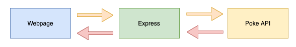

# Pokedex App

You'll be creating a pokedex, a place to view info on all the Pokemon. This app will consist of a front end JS webpage and a backend Express server. The webpage will talk to the Express server who will reach out to the Poke API. 

## Setup
Install Express: 
`npm install express`

Install all dependencies: 
`npm install`

Run server: 
`npm start`

## Requirements
* The user can view all the pokemon. 
* The user can view a picture of each pokemon.
* The user can view the pokemon name and number.
* The system will change the color of the card based on the Pokemons type. For example, yellow for electric.

### Optional
* The user can search pokemon
* The user can view more attributes of each pokemon 
* The user can order pokemon by any attribute
* The user can filter pokemon by any attribute

## Mockup

## Class Diagram
|Pokemon|
| - |
| id: number |
| name: string |
| img: string |
| types: string[] |

## Service Contract
|Method|Path|Response
|-|-|-|
| GET | /pokemons | Pokemon[] |
| GET | /pokemon/:id | Pokemon |

## External Services
[PokeAPI](https://pokeapi.co/)

## Submission
Push to GitHub and create a pull request
